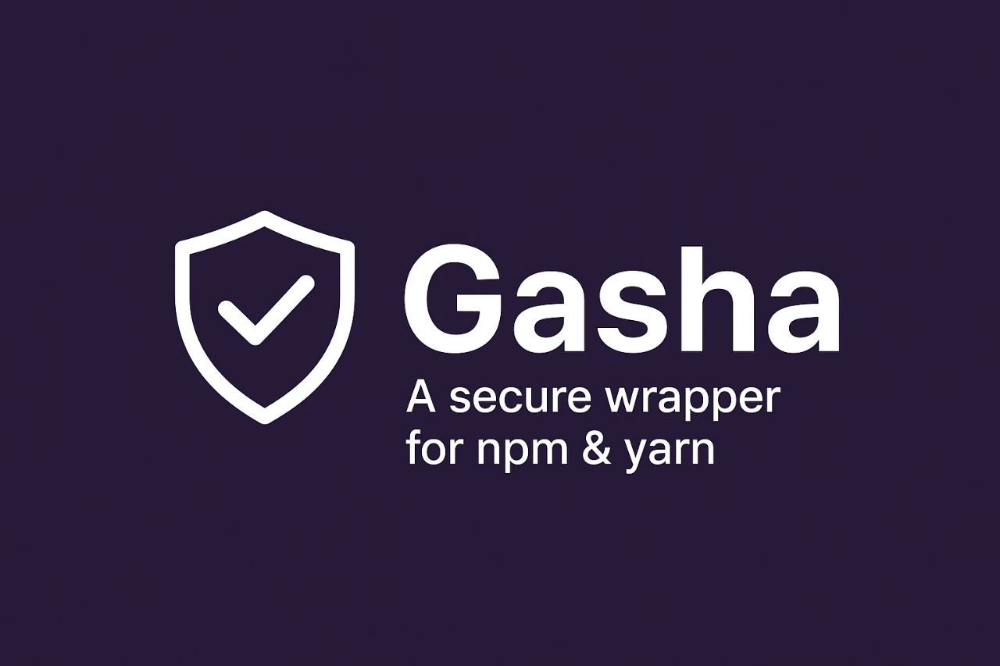

# 🛡️ Gasha — Defense-first Package Manager

**Gasha** is a next-generation secure package manager that protects both **package publishers** and **consumers** from supply chain attacks through cryptographic verification, sandboxed installations, and AI-powered security auditing.

[](https://www.npmjs.com/package/@kilopal/gasha)


[](https://github.com/kilopal/gasha/actions/workflows/ci.yml)


## 🎯 **Why Gasha?**

The npm ecosystem faces growing security threats:
- **Supply chain attacks** (malicious packages, typosquatting)
- **Postinstall scripts** that can execute arbitrary code
- **Dependency confusion** attacks
- **Lack of package integrity verification**
- **No transparency** in package origins

Gasha solves these problems with **defense-in-depth** security.

---

## 🔒 **How Gasha Works**

### **For Package Consumers (Installing Packages)**

When you install a package with Gasha, it performs these security checks:

1. **🔍 SHA256 Verification** - Ensures package integrity hasn't been tampered with
2. **🔐 Cryptographic Verification** - Verifies package signatures (if available)
3. **🛡️ Security Audit** - Scans for suspicious patterns and risky code
4. **📦 Sandboxed Extraction** - Safely extracts packages in isolated Docker containers
5. **📊 AI Analysis** - Optional AI-powered risk assessment

### **For Package Publishers (Publishing Packages)**

When you publish a package with Gasha, it provides:

1. **🔑 Key Generation** - Creates cryptographic keypairs (RSA/Ed25519)
2. **✍️ Package Signing** - Cryptographically signs your packages
3. **📝 Transparency Logging** - Records all signing events in immutable logs
4. **🔍 Security Scanning** - Audits your package before publishing
5. **🌐 Provenance Tracking** - Tracks package origins and build metadata

---

## 🚀 **Quick Start**

### **Installation**

```bash
npm install -g @kilopal/gasha
```

### **System Check**

```bash
gasha doctor
```

This checks if you have all required dependencies:
- ✅ Node.js 16+
- ✅ Python 3.7+
- ✅ Docker (for sandboxing) - with helpful installation links
- ✅ OpenSSL (for key generation) - with helpful installation links
- ✅ Python cryptography library

**Note:** Missing dependencies show helpful installation links for easy setup.

### **For Package Consumers**

**Install a package securely:**

```bash
gasha install express
```

**What happens:**
1. Downloads package from npm registry
2. Computes SHA256 hash
3. Verifies cryptographic signature (if available)
4. Runs security audit (detects risky patterns)
5. Extracts package in sandboxed Docker container
6. Installs to your `node_modules`

**Audit any package for security issues:**

```bash
gasha audit lodash --ai
```

**Output:**
- Security findings with risk scores
- Suspicious code patterns detected
- Optional AI-powered risk summary

### **For Package Publishers**

**Generate cryptographic keys:**

```bash
gasha keygen --out ./keys --algo ed25519
```

**Sign your package:**

```bash
gasha sign ./dist/my-package.tgz --key ./keys/private.pem
```

**Verify signatures:**

```bash
gasha verify ./dist/my-package.tgz --key ./keys/public.pem
```

**Note:** Supports both RSA and Ed25519 key verification with automatic detection.

**View transparency log:**

```bash
gasha log view
```

---

## 🛡️ **Security Features Explained**

### **SHA256 Integrity Verification**
- Computes cryptographic hash of every package
- Prevents tampering during download/transit
- Compares against known good hashes

### **Cryptographic Signing**
- **RSA 2048-bit** and **Ed25519** key support
- Packages signed with private keys
- Verification with public keys
- Prevents unauthorized package modifications

### **Sandboxed Installation**
- Uses Docker containers with strict security policies:
  - `--read-only` filesystem
  - `--network=none` (no network access)
  - `--cap-drop=ALL` (no special privileges)
  - Non-root user execution
- Prevents malicious postinstall scripts

### **Static Security Auditing**
Detects suspicious patterns:
- `eval()` usage (code injection risk)
- `child_process` calls (arbitrary execution)
- `execSync` usage (synchronous execution)
- `postinstall` scripts (lifecycle hooks)
- `process.env` access (environment variables)

### **Transparency Logging**
- **Merkle tree** structure for immutable logs
- Records all signing events
- Cryptographic integrity verification
- Tamper-evident audit trail

### **AI-Powered Analysis**
- Optional OpenAI integration
- Intelligent risk assessment
- Natural language security summaries
- Context-aware threat detection

---

## 🧰 **Complete CLI Reference**

| Command | Description | Example |
|---------|-------------|---------|
| `gasha install <pkg>` | Install package securely | `gasha install express` |
| `gasha verify <pkg>` | Verify package signature | `gasha verify ./pkg.tgz` |
| `gasha audit <pkg>` | Security audit package | `gasha audit lodash --ai` |
| `gasha sign <path>` | Sign a package | `gasha sign ./dist --key ./keys/private.pem` |
| `gasha keygen` | Generate keypair | `gasha keygen --out ./keys --algo ed25519` |
| `gasha log view` | View transparency log | `gasha log view` |
| `gasha doctor` | Check system readiness | `gasha doctor` |
| `gasha explain <pkg>` | Analyze package info & security tips | `gasha explain express` |

### **Command Options**

**Key Generation:**
```bash
gasha keygen --out ./keys --algo ed25519|rsa
```

**Signing:**
```bash
gasha sign ./package.tgz --key ./private.pem --log ./gasha-log.json --policy strict
```

**Verification:**
```bash
gasha verify ./package.tgz --key ./public.pem --verbose
```

**Auditing:**
```bash
gasha audit express --ai --output json
```

---

## 📦 **Node.js API**

```javascript
const { verify, sign, audit, keygen } = require('@kilopal/gasha');

// Generate keypair
await keygen('./keys', 'ed25519');

// Sign a package
const success = await sign('./dist/package.tgz', './keys/private.pem');

// Verify a package
const isValid = await verify('./package.tgz', './keys/public.pem');

// Audit a package
const report = await audit('express', { ai: true });
console.log(`Risk score: ${report.score}/100`);
console.log(`Findings: ${report.findings.length}`);
```

---

## 🔧 **Use Cases & Examples**

### **For Open Source Maintainers**

**Secure Package Publishing:**
```bash
# 1. Generate signing keys
gasha keygen --out ./keys --algo ed25519

# 2. Build your package
npm run build

# 3. Sign the tarball
gasha sign ./dist/my-package-1.0.0.tgz --key ./keys/private.pem

# 4. Publish to npm (with signature)
npm publish ./dist/my-package-1.0.0.tgz
```

### **For Enterprise Teams**

**Secure Dependency Management:**
```bash
# Audit all dependencies
gasha audit express --ai
gasha audit lodash --ai
gasha audit react --ai

# Install only verified packages
gasha install express
gasha install lodash
```

### **For Security Teams**

**Supply Chain Monitoring:**
```bash
# Check package integrity
gasha verify ./suspicious-package.tgz --key ./trusted-keys/public.pem

# Audit for malicious patterns
gasha audit ./package --ai --output json > security-report.json

# View signing history
gasha log view
```

---

## 🔑 **GitHub Actions Integration**

**Secure CI/CD Pipeline:**

```yaml
name: Secure Package Publishing
on:
  release:
    types: [published]

jobs:
  publish:
    runs-on: ubuntu-latest
    steps:
      - uses: actions/checkout@v3
      
      - name: Setup Node.js
        uses: actions/setup-node@v3
        with:
          node-version: '18'
          
      - name: Install Gasha
        run: npm install -g @kilopal/gasha
        
      - name: Generate Keys
        run: gasha keygen --out ./keys --algo ed25519
        
      - name: Build Package
        run: npm run build
        
      - name: Sign Package
        run: gasha sign ./dist/package.tgz --key ./keys/private.pem
        
      - name: Publish to npm
        run: npm publish ./dist/package.tgz
        env:
          NPM_TOKEN: ${{ secrets.NPM_TOKEN }}
```

---

## 🧭 **Roadmap**

- ✅ **Phase 1** → SHA256 verification, sandboxing, static auditing
- ✅ **Phase 2** → Cryptographic signing, transparency logs, AI analysis
- 🚧 **Phase 3** → Plugin system, provenance metadata, advanced integrations
- 🚀 **Phase 4** → Transparency dashboard, community features

---

## 🤝 **Contributing**

We welcome contributions! Here's how to get started:

1. **Fork the repository**
2. **Clone your fork:** `git clone https://github.com/kilopal/gasha.git`
3. **Install dependencies:** `npm install`
4. **Install Python dependencies:** `pip install cryptography`
5. **Make your changes** in the `lib/` directory
6. **Test your changes:** `npm test`
7. **Submit a pull request**

### **Development Setup**

```bash
# Clone and setup
git clone https://github.com/kilopal/gasha.git
cd gasha
npm install
pip install cryptography

# Run tests
npm test

# Test CLI
node bin/gasha.js test-run
```

---

## 📜 **License**

MIT © 2025 Mockilo Labs

---

## 🆘 **Support & Community**

- **Issues:** [GitHub Issues](https://github.com/kilopal/gasha/issues)
- **Discussions:** [GitHub Discussions](https://github.com/kilopal/gasha/discussions)
- **Security:** [Security Policy](SECURITY.md)

---

**Gasha** - Making the npm ecosystem safer, one package at a time. 🛡️
